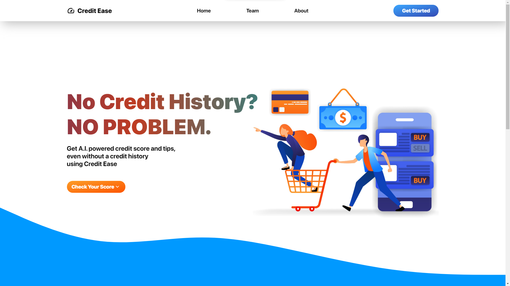
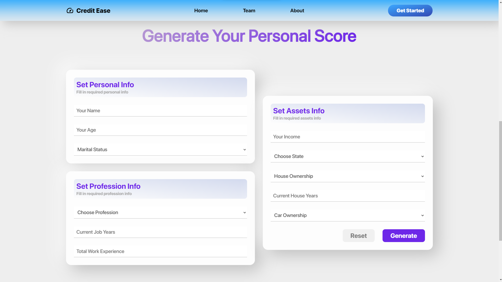
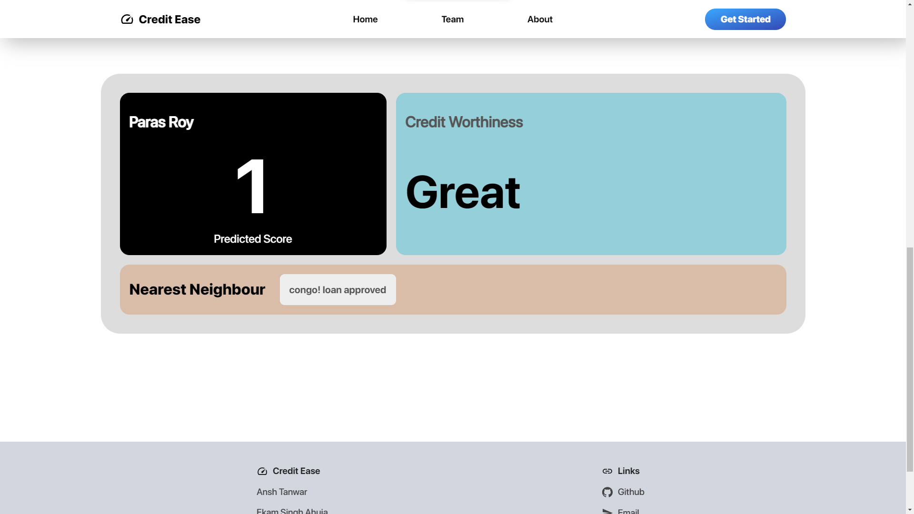

# Credit-Ease

# Improved credit scoring - (FinTech)

Conventional credit scoring methods like credit history, collateral, or any prior accounts might not give every person an equal opportunity to establish credit. As a result, a small number of people can access basic banking services like opening a bank account and acquiring a loan. Using the pre-existing datasets, we can understand the track record of banks and the reason why conventional credit scoring is needed. Come up with an AI based solution to perform credit scoring for people who don’t have any previous loans. This can be done by checking some other billing cycles they’ve been a part of and creating a scoring metrics on the basis of that.

## Get a credit score using AI, even without a credit history. 

## Key Features of our Solution     
  1. Credit Score Prediction without credit or loan history, collateral, or any prior account information.
  2. AI based solution solution and generating scoring metrics based on different parameters
  3. Providing the best Ai AI-generated recommendation to improve the Score according to person present conditions.
     
Website Link: https://credit-ease.vercel.app/  

Video Link: https://youtu.be/Dt654Q-2Ads

A Project by Ansh Tanwar, Ekam Singh Ahuja and Paras Roy - Team CatchUs.
